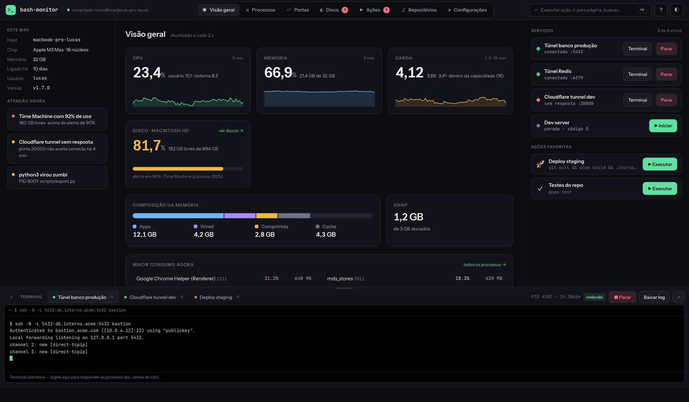
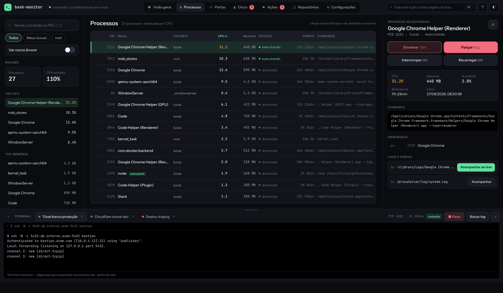
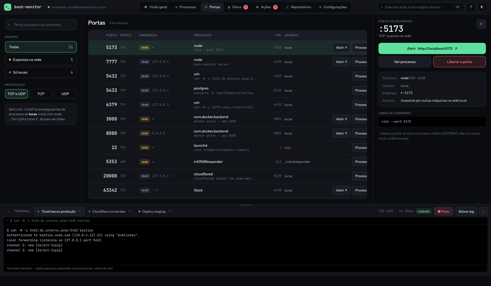
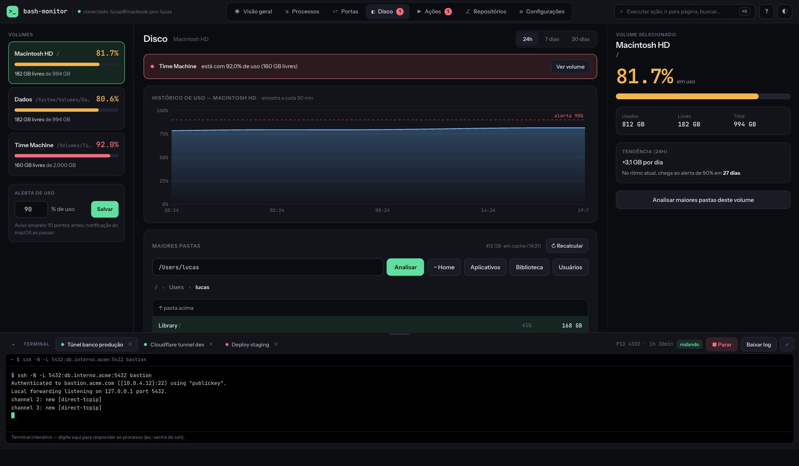
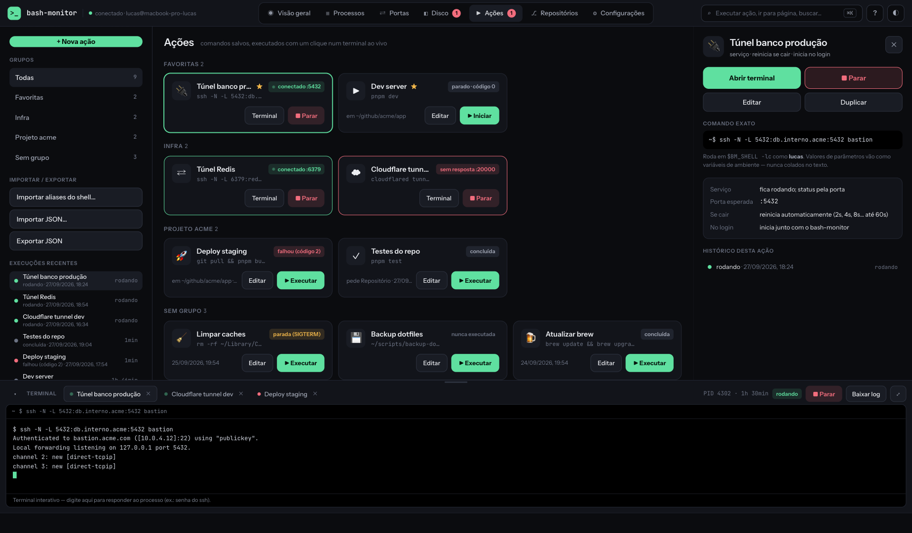
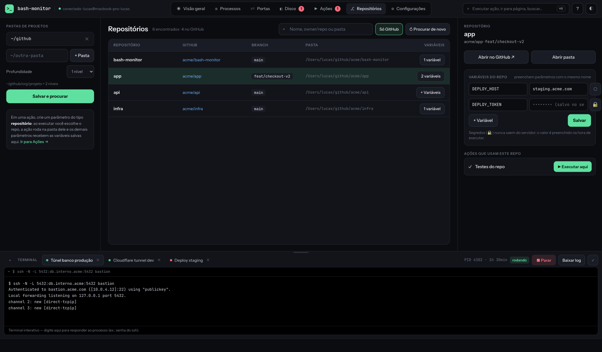
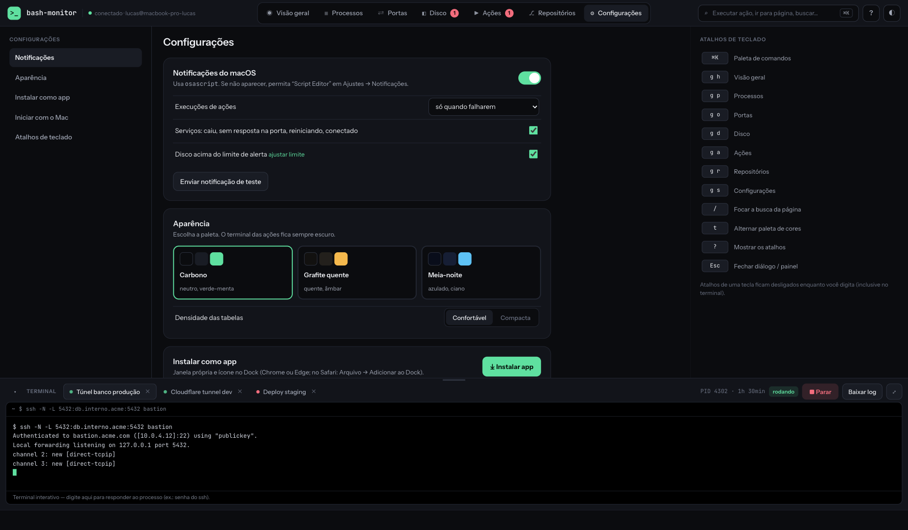
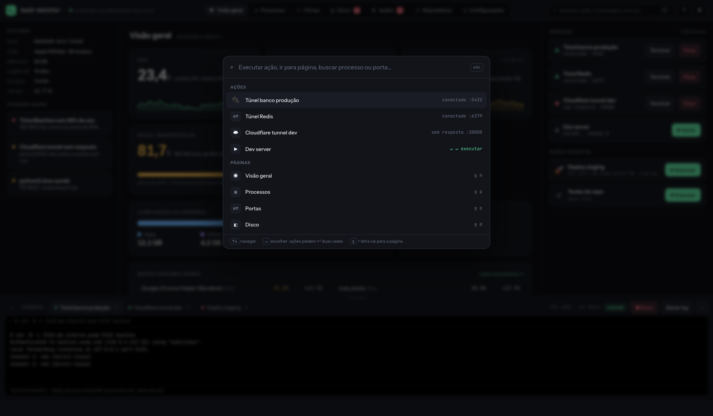

# macpit — Redesign "Cockpit"

Redesign completo da interface do [macpit](https://github.com/andrade-ramon/macpit) (dashboard local para monitorar e gerenciar o Mac pelo navegador), com foco em **telas ultrawide e desktops grandes** e em tornar cada ação óbvia e a um clique de distância.

Este repositório contém **protótipos de design em HTML** (não é o código do produto). Eles rodam direto no navegador, com dados de exemplo, e servem de referência para a implementação em `apps/web`.

## Arquivos

| Arquivo | O que é |
|---|---|
| `Redesign Cockpit.dc.html` | **Protótipo interativo do redesign** — todas as telas, paleta ⌘K, confirmações, dock de terminal |
| `Atual (referência).dc.html` | Recriação fiel da UI atual (sidebar + Tailwind slate), para comparação lado a lado |
| `mock-data.js` | Dados de exemplo compartilhados (processos, portas, volumes, ações, execuções, repositórios), seguindo os tipos de `@macpit/shared` |
| `../screenshots/` | Capturas das telas usadas neste README |

## Como rodar

Não há build. Basta abrir o arquivo em um navegador moderno (Chrome, Edge, Safari, Firefox):

```bash
git clone <este repositório>
cd <pasta>
open "Redesign Cockpit.dc.html"        # macOS
# ou sirva a pasta para evitar restrições de file://
npx serve .                            # http://localhost:3000
```

> As fontes (Instrument Sans e JetBrains Mono) vêm do Google Fonts; sem internet o protótipo cai para as fontes do sistema.

### Controles do protótipo

- **Navegação**: abas no topo ou `g` + letra (`g p` → Processos, `g a` → Ações…).
- **⌘K / Ctrl+K**: paleta de comandos. `?` mostra os atalhos. `t` alterna a paleta de cores. `Esc` fecha diálogos.
- **Tweaks** (painel do host): `theme` (Carbono · Grafite quente · Meia-noite), `density` (Confortável · Compacta), `dockOpen`, `showRootBanner` e `previewWidth` (simula 1920/2560/3440 px de largura numa janela menor).
- Abaixo de 1500 px o layout de três colunas recolhe: os painéis laterais abrem pelos botões **Filtros** / **Detalhes** no cabeçalho.

## Como o redesign funciona

### Estrutura: barra superior + 3 colunas + dock

```
┌──────────────────────────────────────────────────────────────────┐
│ >_ macpit · conectado   [Visão geral][Processos]…  ⌕ ⌘K ? ◐ │
├────────────┬────────────────────────────────────┬────────────────┤
│ CONTEXTO   │ CONTEÚDO PRINCIPAL                 │ INSPETOR       │
│ filtros,   │ tabela / cards / gráficos          │ item selecionado│
│ resumo,    │                                    │ + ações grandes │
│ atalhos    │                                    │                 │
├────────────┴────────────────────────────────────┴────────────────┤
│ ▾ TERMINAL  [● Túnel banco] [● Cloudflare] [● Deploy]  ■ Parar  ⤢ │
│ $ ssh -N -L 5432:db.interno:5432 bastion                          │
└──────────────────────────────────────────────────────────────────┘
```

- **Coluna esquerda (contexto)** — filtros, resumos e listas rápidas da tela (Top CPU, grupos de ações, volumes…). Nunca é preciso rolar para filtrar.
- **Coluna central (conteúdo)** — a lista/tabela principal, com linhas confortáveis (44 px) e a ação mais comum inline (ex.: *Encerrar*, *Liberar*, *Executar*).
- **Coluna direita (inspetor)** — detalhe do item selecionado com **botões grandes, sempre no mesmo lugar**: encerrar/forçar, abrir no navegador, executar/parar, editar.
- **Dock inferior (terminal, estilo IDE)** — abas de execuções, redimensionável por arraste, recolhível, com *Parar*, *Executar de novo* e *Baixar log* no cabeçalho. Fica disponível em qualquer tela, então um serviço pode ser acompanhado enquanto se olha Processos ou Portas.

### Princípios aplicados

1. **Ação principal sempre visível e grande** — nada de botões `btn-sm` no canto do card; o que você mais faz tem 40–46 px de altura e cor própria (verde = executar, vermelho = encerrar).
2. **Seleção → inspetor** — clicar em qualquer linha abre os detalhes à direita sem sair da lista; a linha selecionada fica marcada.
3. **Confirmação transparente** — todo encerramento mostra o sinal, o PID e o comando exato antes de enviar.
4. **Estado do sistema no rosto** — "Atenção agora" na Visão geral, badges numéricos nas abas (disco em alerta, serviço sem resposta), pontos pulsando em serviços ativos.
5. **Ultrawide sem desperdício** — o grid usa toda a largura; abaixo de 1500 px degrada para uma coluna com painéis sob demanda.

### Direções visuais

Três paletas escuras, trocáveis pelo tweak `theme`, pela tecla `t` ou em Configurações → Aparência:

- **Carbono** (padrão) — neutro, acento verde-menta.
- **Grafite quente** — tons quentes, acento âmbar.
- **Meia-noite** — azulado, acento ciano.

Tipografia: *Instrument Sans* para interface e *JetBrains Mono* para PIDs, comandos, portas e tamanhos.

## Telas

### Visão geral
CPU, memória, carga e disco em tiles grandes com sparklines; "Este Mac" e "Atenção agora" à esquerda; serviços e ações favoritas com *Iniciar/Parar/Executar* à direita.



### Processos
Busca, filtro por usuário e árvore à esquerda; tabela ordenável com *Encerrar* inline; inspetor com os quatro sinais (TERM/KILL/INT/HUP), hierarquia pai/filhos e logs com *Acompanhar ao vivo*.



### Portas
Escopo (rede/local) e protocolo como filtros de um clique; número da porta em destaque; *Abrir ↗*, *Processo* e *Liberar* em cada linha; inspetor explica o alcance da porta e o que "liberar" faz.



### Disco
Volumes selecionáveis e limite de alerta à esquerda; histórico grande e explorador de maiores pastas no centro; detalhe do volume com tendência e previsão de chegada ao alerta à direita.



### Ações
Grupos, importação/exportação e execuções recentes à esquerda; cards com *Executar/Parar* grandes e status de serviço; inspetor com parâmetros `{{nome}}`, comando exato, configuração do serviço e histórico. O terminal abre no dock inferior.



### Repositórios
Pastas de projetos à esquerda; tabela de repos (GitHub, branch, pasta); variáveis do repositório (com segredos) e ações que o usam à direita.



### Configurações
Seções à esquerda; notificações, aparência (paleta + densidade), instalar como app e LaunchAgent no centro; atalhos de teclado sempre visíveis à direita.



### Paleta ⌘K
Resultados agrupados (Ações, Páginas, Buscar, GitHub), linhas de 44 px com ícone e dica; ações pedem `↵` duas vezes para evitar execução acidental.



## Ainda não desenhado

- Editor de ação (modal de criar/editar) e diálogo "Importar do shell".
- Estados vazio, erro e "servidor offline".
- Tema claro.
